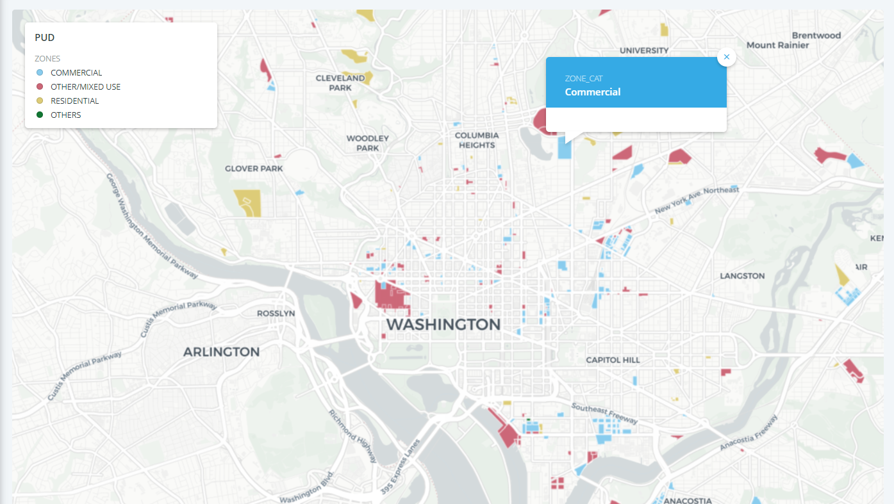

# Lab3 - Creating Zoning maps using Python and Pandas.

This lab uses Python and the libraries available in Python including Pandas to create zoning maps for Washington, DC. Understanding the zoning and the rules associated with how the land is used is important to analyze the evictions during housing crisis. The government of Washington is offering amenities such as affordable housing and improved public transportation in exchange for zoning exemptions. The map of the zoning exemptions in this project could be overlayed with other demographic data to visualize and analyze the buildings that received a zoning exemption in Washington, DC. 

